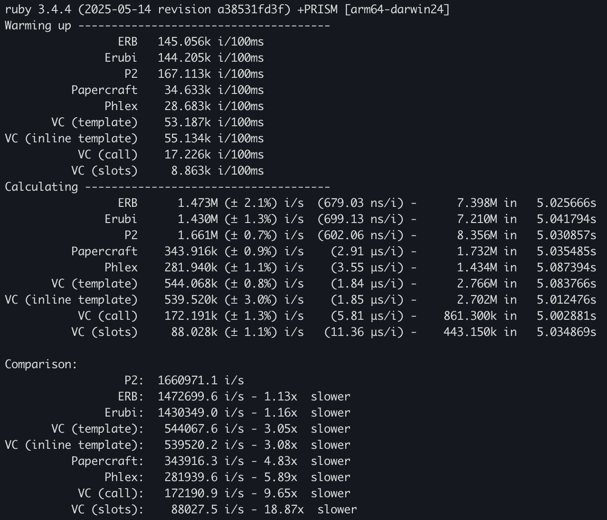
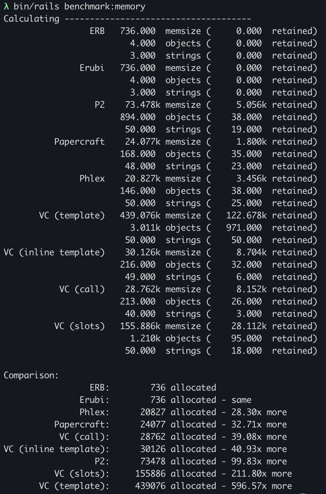

# Benchmarking HTML rendering in Ruby  

Inspired by [the recent blog post and benchmarks](https://noteflakes.com/articles/2025-08-18-how-to-make-ruby-faster)
published by Sharon Rosner [@noteflakes](https://github.com/noteflakes),  
I added ViewComponent and memory benchmarks to the mix.

Here are the contestants:
* [ERB](https://github.com/ruby/erb)
* [Erubi](https://github.com/jeremyevans/erubi)
* [P2](https://github.com/digital-fabric/p2)
* [Papercraft](https://github.com/digital-fabric/papercraft)
* [Phlex](https://github.com/yippee-fun/phlex)
* [ViewComponent (VC)](https://github.com/ViewComponent/view_component)

This is my setup:

```
MacBook Pro, 14-inch, Nov. 2024
Apple M4
16 GB memory
macOS 15.6
Ruby 3.4.4
```

These are my results as of August 20, 2025:



And the memory benchmark:



And here's how you can run the benchmarks yourself:

```
git checkout git@github.com:rubiii/ruby_rendering_benchmarks.git
cd ruby_rendering_benchmarks
bundle
bin/rails benchmark:ips
bin/rails benchmark:memory
```

If I messed something up, please let me know.
